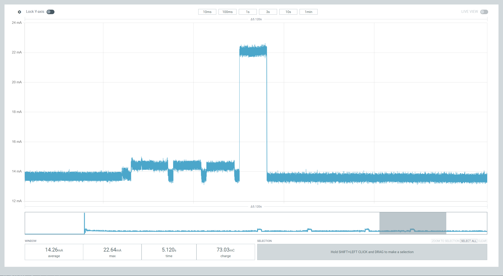

# Arduino Broadlink RM Mini IR Translator

## Summary
An Arduino project that provides full control over the Broadlink WiFi RM Mini 3.

## Back Story
A couple of months ago, I bought [a small disco ball](https://www.amazon.com/gp/product/B0D2SVSR26/) for my child's room.

It's decent, and the battery life is satisfactory, but most importantly, my toddler loves it! Since we knew we wanted to keep it, I decided to integrate it with Google Home so I could control it with voice commands, e.g., by saying, "Hey Google, turn off the disco ball in 20 minutes." To achieve this, I purchased one of my favorite devices, the [Broadlink WiFi Smart Home Hub RM Mini 3](https://www.amazon.com/dp/B07K2DHXB6). However, after a quick setup, I was disappointed. To turn the disco ball off, you have to press a button three times quickly. This is a bit annoying, and the Hub RM Mini 3 didn’t seem to support it. I confirmed with their support that:

> If your physical remote requires pressing a button three times to send a different IR code, this cannot be supported by the BroadLink RM device. However, you can try creating three separate buttons for your physical remote and learn each press. You can then try controlling it and see if it works. Long press actions are also not supported.

## Solution

So, I built an Arduino circuit that acts as a middleman. It reads the Broadlink RM Mini 3 IR signals, and when it detects a command, it translates it to more complex disco ball remote control actions, like pressing a button three times.

Encoding and decoding IR commands has been around for over 30 years, so *there are better projects* out there, like [IRremote](https://github.com/Arduino-IRremote/Arduino-IRremote), used by [this excellent example](https://github.com/mattcuk/IRtranslator). If you’re starting from scratch, you might want to use their code instead of mine. One thing they might not have is powering down the processor when it’s idle. In any case, I reinvented the wheel because I enjoy the process, and I got to use tools I had on hand.

Here’s the sketch:

## Components

The components I used are:

* I started with an Arduino Uno for quick development but eventually switched to a SparkFun Arduino Pro Mini - 5V, as it’s smaller and I won’t need to change the software often.
* I used a [Micro USB Type B Receptacle](https://www.mouser.com/ProductDetail/649-10118192-0001LF) to get 5V power via USB. [This splitter](https://www.amazon.com/dp/B00ISLNSH0) allowed me to power both the Broadlink RM Mini 3 and my Arduino with the same cable.
* I used a [VS1838B](https://www.amazon.com/dp/B06XYNDRGF) to receive IR and decode the 38kHz carrier. The signal is fed directly to Arduino's Pin 2, which also triggers an interrupt upon logic level change and wakes the Arduino from sleep.
* I used two [TS-242 IR LEDs](https://tinkersphere.com/standard-leds/242-ir-led-25-pack.html) because I had them available and knew their specs, including the 2.4V - 2.6V forward voltage. This was important because I burned out an IR LED, which wasted some time figuring out. I’d rather avoid burnt LEDs!

## Development
I made the Broadlink RM Mini 3 pretend it’s an LG 32LE4500. I chose that protocol because it’s short and very similar, if not identical, to the one the disco ball uses.

I used a [DSLogic U3Pro16 logic analyzer](https://www.amazon.com/dp/B08C2LCBGL) to decode the IR signals from the remote control. I bought this analyzer specifically for this project, though I suspect that much of the motivation behind this project was an excuse to play with it before using it on more complex projects.

I also used a [Nordic Semiconductor Power Profiler Kit II](https://www.digikey.com/en/products/detail/nordic-semiconductor-asa/NRF-PPK2/13557476) to measure power consumption. I made a small code modification to enable power-saving mode when the system is idle. The VS1838B consumes 0.4 mA according to its datasheet (I measured 220µA when idle and 350µA when active), so this won’t be an ultra-low-power design, but I’m happy to write a few lines of code to make it greener. The idle mode reduces the current from 14 mA to 8 mA. Deeper sleep modes like the standby mode were promising, but didn't work out because they messed with accuracy of time measurement between interrupts.

VS1838B Power Consumption:

System Power Consumption - No Power Down Mode:

System Power Consumption - With Power Down Mode:

At the end I also removed the Arduino Pro Mini power led - in the spirit of lowering power. 

I also had to make a quick fix to the tone Arduino library with this PR [Quick Fix of overflow for larger toggle_count values by lookfwd · Pull Request #565](https://github.com/arduino/ArduinoCore-avr/pull/565). I didn't expect that I would hit an Arduino core bug that quickly, but here we are.
